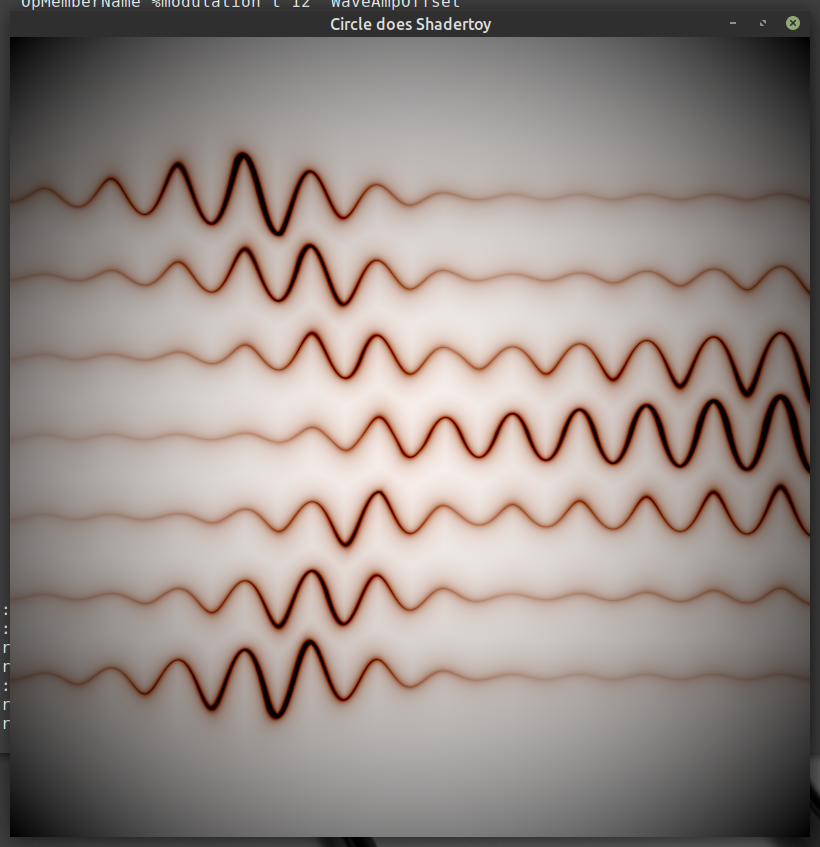
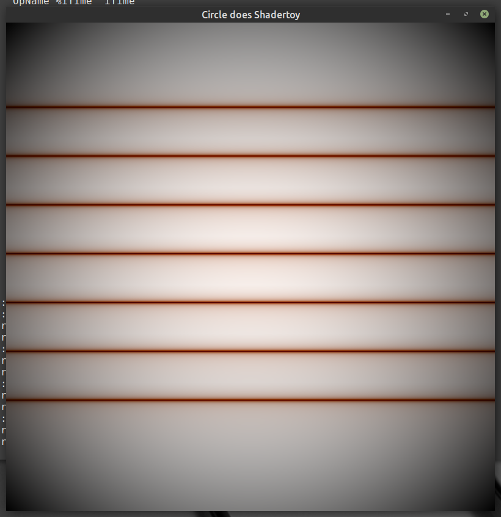
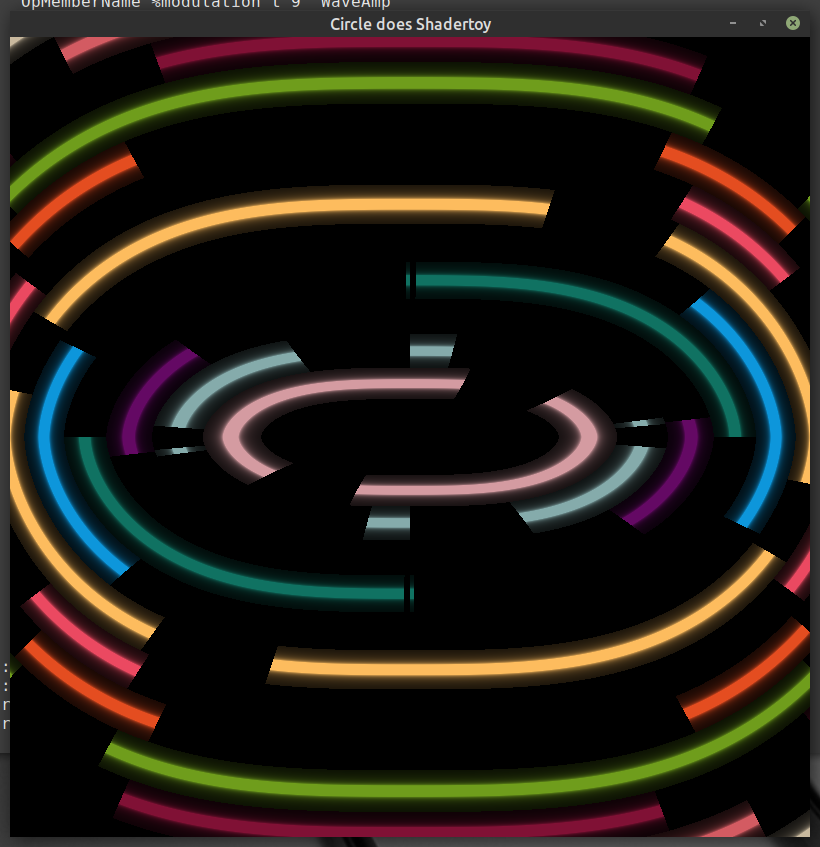

# Fragment shader SPIR-V module contamination

```
# Link the individual fragment shaders into linked.spv
$ spirv-link modulation.spv bands.spv -o linked.spv

# Compile executables that read from the non-linked modules
$ clang++ shadertoy.cxx -DMODULATION -o modulation -lGL -lgl3w -lglfw
$ clang++ shadertoy.cxx -DBANDS -o bands -lGL -lgl3w -lglfw

# Compile executables that read from the linked module.
$ clang++ shadertoy.cxx -DLINKED -DMODULATION -o modulation_linked -lGL -lgl3w -lglfw
$ clang++ shadertoy.cxx -DLINKED -DBANDS -o bands_linked -lGL -lgl3w -lglfw
```

Linking two SPIR-V modules results in an executable that renders incorrectly. The presence of a second fragment shader (bands) corrupts the fragment shader that actually gets specialized and linked (modulation). Each shader works fine indepently. The nvidia SPIR-V compiler incorrectly reads the modulation shader when it shares a module with the bands shader.

**./modulation**


**./modulation_linked**


**./bands**


